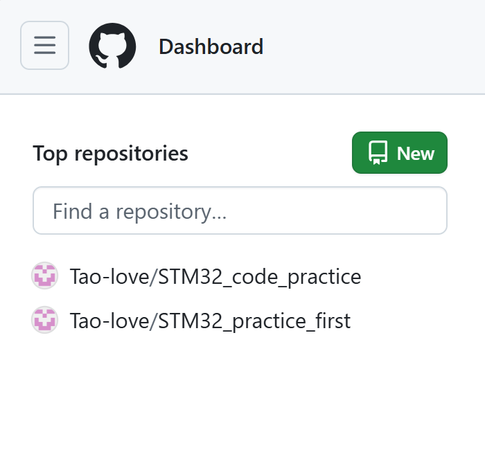
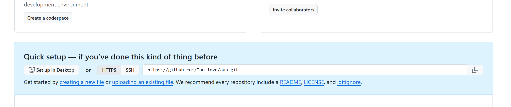

##
1-首先在需要的文件夹右键内打开终端

2-其次git init初始化仓库

3-
分别输入git config user.name "名字"
       git config user.email "邮箱"
注意：这里输入不会有任何返回
      输入git config user.name和git config user.email可检查是否成功输入
4-git add .  （无返回）
  git commit -m "说明这次修改"  
  git push
  - `git add .`：把改动加入暂存区
- `git commit -m "这是注释"`：把暂存区内容保存成一次提交
- `git push`：把本地提交上传到远程仓库(这是有远程仓库后用的)

##
远程仓库初始化：

点new
创建之后

复制这个地址
然后输入git remote add origin 地址